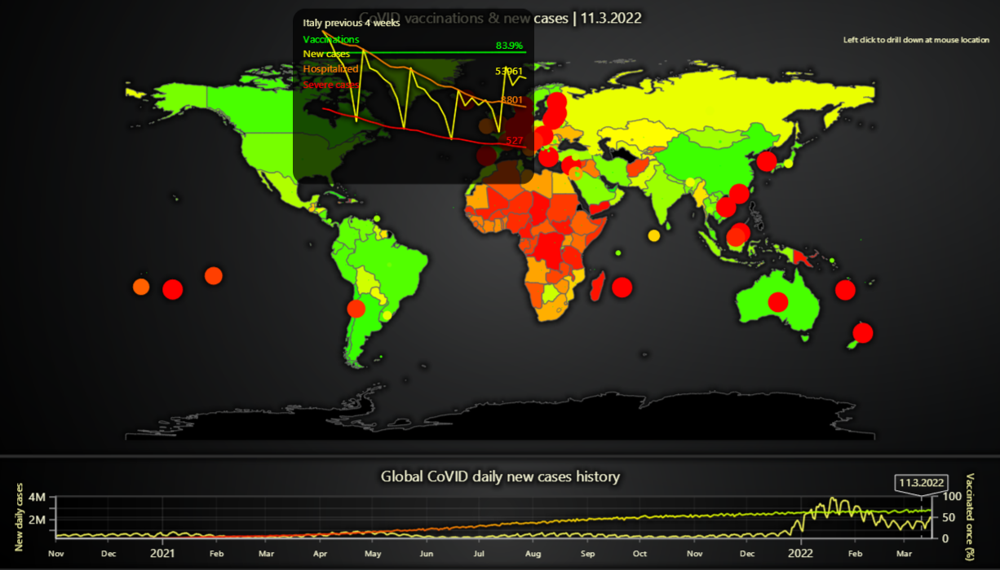

# JavaScript Drill-Down CoVID Map Dashboard

This demo application belongs to the set of examples for LightningChart JS, data visualization library for JavaScript.

LightningChart JS is entirely GPU accelerated and performance optimized charting library for presenting massive amounts of data. It offers an easy way of creating sophisticated and interactive charts and adding them to your website or web application.

The demo can be used as an example or a seed project. Local execution requires the following steps:

-   Make sure that relevant version of [Node.js](https://nodejs.org/en/download/) is installed
-   Open the project folder in a terminal:

          npm install              # fetches dependencies
          npm start                # builds an application and starts the development server

-   The application is available at _http://localhost:8080_ in your browser, webpack-dev-server provides hot reload functionality.

## Description

LightningChart JS example which showcases combination of `MapChart` and `ChartXY` features to implement a multi-dimensional data visualization. Amount of new CoVID cases in each country are displayed with a bubble (size and color represents number of new cases), while country color represents the vaccination coverage in the country (1 or more vaccines).

[//]: # 'IMPORTANT: The assets will not show before README.md is built - relative path is different!'

The global number of daily cases as well as average vaccination coverage is displayed at the bottom. The active date that is displayed in the main chart above can be changed by dragging on the slider.

[//]: # 'IMPORTANT: The assets will not show before README.md is built - relative path is different!'

By placing mouse cursor above the main chart, a popup chart will be displayed over the nearest country from the mouse location. This chart shows the previous 4 weeks data from the active date. Depending on availability, the following data will be shown:

-   Vaccination coverage (1 vaccination, % of country population)
-   New CoVID cases (graph displays number relative to population, while label displays actual number of cases)
-   Hospitalized CoVID patients (graph displays number relative to population, while label displays actual number of patients)
-   Intensive care CoVID patients (graph displays number relative to population, while label displays actual number of patients)

The idea behind measurements relative to population is that the readings can be compared between countries, even if they might have different number of citizens.

[//]: # 'IMPORTANT: The assets will not show before README.md is built - relative path is different!'

**Drill-down to data**

By left-clicking once, you can drill down around the mouse location. For example, clicking around the Europe area will zoom the map view into just Europe. Further more, you can drill down into a single country to show the full historical progression of that country's CoVID data.

In this view you can also compare a single country's data to the calculated average from available global data.

[//]: # 'IMPORTANT: The assets will not show before README.md is built - relative path is different!'

Zooming back out can be done by double left-clicking.

**Data sources**

General CoVID data is from the openly accessible _Owid Covid dataset_ found in [GitHub](https://github.com/owid/covid-19-data/tree/master/public/data).

CoVID Vaccine data is referenced from the work of [Hasell, J., Mathie, E., Beltekia, D. et al. A cross-country database of COVID-19 testing. Sci Data 7, 345 (2020).](https://doi.org/10.1038/s41597-020-00688-8)

Contains information from [World countries by Modammed Le Doze](https://github.com/mledoze/countries), which is made available here under the [Open Database License (ODbL)](https://github.com/mledoze/countries/blob/master/LICENSE).

**More map examples**:

-   [Data visualization over LightningChart JS Map Charts](https://lightningchart.com/lightningchart-js-interactive-examples/examples/lcjs-example-1103-mapChartVizXY.html)
-   [Data visualization over Google Maps](https://blog.arction.com/easy-geospatial-data-visualization-with-lightningchart-js-and-google)
-   [Simple Countries Visualization](https://lightningchart.com/lightningchart-js-interactive-examples/examples/lcjs-example-1101-mapChartDynamicColor.html)
-   [Data visualization over static map picture](https://lightningchart.com/lightningchart-js-interactive-examples/examples/lcjs-example-1110-geoChartUsaTemperature.html)

## API Links

* [Dashboard]
* [Map Chart]
* [Chart XY]
* [Axis]
* [Axis scroll strategies]
* [Axis tick strategies]
* [Lookup table]
* [Line series]
* [Point series]
* [Band]

## Support

If you notice an error in the example code, please open an issue on [GitHub][0] repository of the entire example.

Official [API documentation][1] can be found on [LightningChart][2] website.

If the docs and other materials do not solve your problem as well as implementation help is needed, ask on [StackOverflow][3] (tagged lightningchart).

If you think you found a bug in the LightningChart JavaScript library, please contact support@lightningchart.com.

Direct developer email support can be purchased through a [Support Plan][4] or by contacting sales@lightningchart.com.

[0]: https://github.com/Arction/
[1]: https://lightningchart.com/lightningchart-js-api-documentation/
[2]: https://lightningchart.com
[3]: https://stackoverflow.com/questions/tagged/lightningchart
[4]: https://lightningchart.com/support-services/

© LightningChart Ltd 2009-2022. All rights reserved.

[Dashboard]: https://lightningchart.com/lightningchart-js-api-documentation/v4.1.0/classes/Dashboard.html
[Map Chart]: https://lightningchart.com/lightningchart-js-api-documentation/v4.1.0/classes/MapChart.html
[Chart XY]: https://lightningchart.com/lightningchart-js-api-documentation/v4.1.0/classes/ChartXY.html
[Axis]: https://lightningchart.com/lightningchart-js-api-documentation/v4.1.0/classes/Axis.html
[Axis scroll strategies]: https://lightningchart.com/lightningchart-js-api-documentation/v4.1.0/variables/AxisScrollStrategies.html
[Axis tick strategies]: https://lightningchart.com/lightningchart-js-api-documentation/v4.1.0/variables/AxisTickStrategies.html
[Lookup table]: https://lightningchart.com/lightningchart-js-api-documentation/v4.1.0/classes/LUT.html
[Line series]: https://lightningchart.com/lightningchart-js-api-documentation/v4.1.0/classes/LineSeries.html
[Point series]: https://lightningchart.com/lightningchart-js-api-documentation/v4.1.0/classes/PointSeries.html
[Band]: https://lightningchart.com/lightningchart-js-api-documentation/v4.1.0/classes/Band.html

